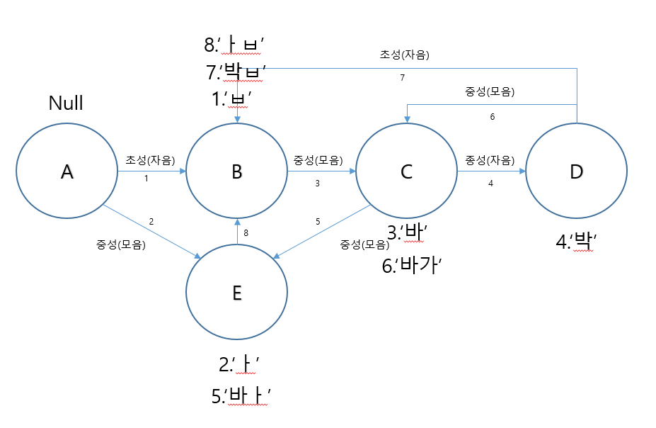

# Keyboard-Study
안드로이드 키보드 모델에 대한 학습자료

## Firstmodel 
* android.inputmethodservice.Keyboard 라이브러리(API 29버전에서 분리됨)
* 다른 커스텀 레이아웃의 keyevent사용 필요

### InputMethodService
> - currentInputConnection: 현재 커서를 담고 있는 인덱스를 알고 추가, 변경, 삭제기능을 담당.
> - key event를 감지하여 휴대폰과 Connection을 담당

### Service
> - service로 등록하여 다른 애플리케이션이 실행중일 경우에도 사용이 가능하다.
> - 발생하는 KeyEvent를 감지하고 정의된 동작에 따라 EditText의 변경을 담당한다.

### KeyboardView
> - OnKeyboardActionListener를 상속하여 KeyboardView의 onKey메소드 재정의.
> - 키보드를 변경해야할 경우 KeyboardView의 속성인 keyboard를 변경하면 된다.

### Keyboard
> - xml에 정의된 key_layout을 의미함.
> - 한글, 영어로 정의되어 있고, 영어 유니코드를 기반으로 설정하여 한글의 경우 mapping과정을 통하여 변환되는 과정을 거침.(ex. 'q'->'ㅂ')

### Automata
> - firstmodel의 경우 "", "ㅂ", "바", "박", "ㅏ" 의 다섯가지 상태를 가짐.
> - 각자의 상태에서 기대되는 다음 입력에 따라 상태가 변함.

## Secondmodel
* 다른 뷰 레이아웃에서 keyevent사용 가능성 확인
* 한글 오토마타 기능 완성(이중모음, 이중자음)
* 한글패드, 영문패드, 숫자패드, 특수기호패드 기능 추가
* Key입력 시 소리 또는 진동 추가(사용자가 커스텀 가능하도록)
* Long Click 입력 시 글자 변경 기능 추가(변경되는 기호는 미정)

* 자동완성 기능 추가

### Service
> - currentInputConnection: 현재 커서를 담고 있는 인덱스를 알고 추가, 변경, 삭제기능을 담당.
> - KeyEvent를 KeyboardView객체가 아닌 Instrumentation객체가 송신하고 버튼의 ClickListener를 통하여 트리거한다.
> - KeyboardView의 OnKeyboardActionListener가 아닌 서비스 자체의 OnKeyDown메소드를 통하거나, 키보드 전체의 뷰를 담당하는 LinearLayout(Constraint Layout등으로 대체 가능)의 OnKeyListener를 통하여 KeyEvent를 감지할 수 있다.

### KeyboardView & Keyboard
> - API level 29 부터 deprecate되기 때문에 삭제한다.
